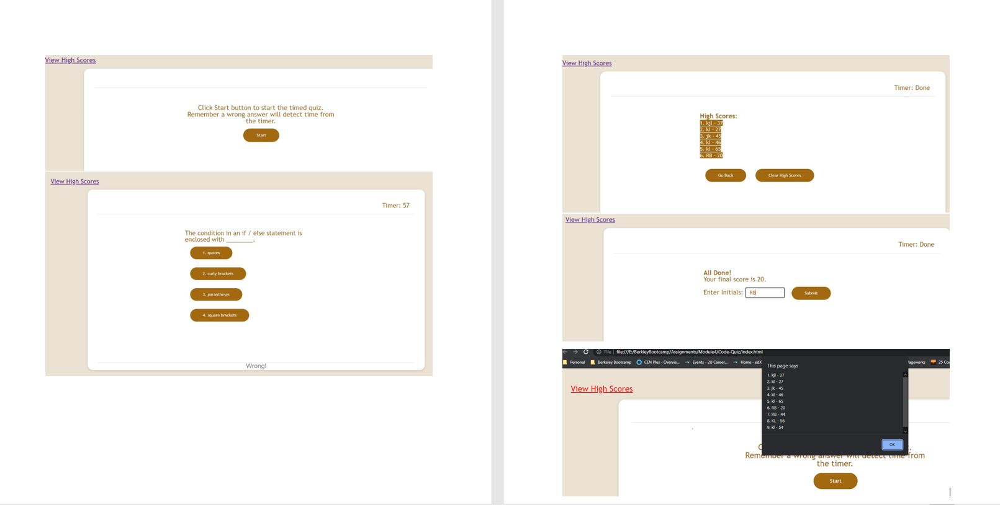

# Code-Quiz
Repository for Module 4 Challenge - Code Quiz using HTML, CSS, JavaScript and Web APIS

## Description
Code Quiz runs a timed Javascript quiz and displays the high scorea fo al the participants.  Here are the features of this program:

1. At the start of the Quiz, a message is displayed informing the user about the rule that any wrong answer will result in time detected from the timer.  it also displays the Start button.
2. When the user clicks the Start button:
    * The timer starts at 75 seconds on the upper right corner of the header
    * The first question is displayes with 4 button choices to select he answer from.     
3. When the user selects one of the 4 buttons:
    * A message is displayed in the footer - "Correct!" if the answer selected is correct and "Wrong!" if the choice is incorrect.
    * If this question was not the last question and the timer is not zero, the next question is displayed.
    * 10 seconds are detected from the timer if the answer choice is wrong.   None is detected for a correct answer.
4. If the question is the last one or the timer has reached zero:
    * The timer displays "Done" on header
    * A message "All Done!" is displayed.
    * The final score which is the time left on the timer)
    * An input box for the user to type in their initials
    * A Submit button is displayed 
5. When the uer type in their initials and click on the Submit button:
    * A list of high scores with initials and scores from previous sessions is displayed
    * Initials and score from this sessions are displayed appended to the end.
    * If this is the first round, only score from thisround is displayed.
    * A "Go Back" button is displayed
    * A "Clear High Score" button is displayed
6. When the "Go Back" button is pressed, the quiz start again with message described in step #1 above and Start button.
7. When "Clear High Score" is pressed, nothing happens.  
8. At any point in the game, if the user clicks on "View High Score" link on top left corner, the list of high scores so far from all sessions is displayed in an alert popup.

## Mock Up

Demo of the project:

## Usage
You can access:
1. the file in GitHub repository: https://github.com/rbhumbla1/Code-Quiz
2. the application using this URL: https://rbhumbla1.github.io/Code-Quiz

## License
None